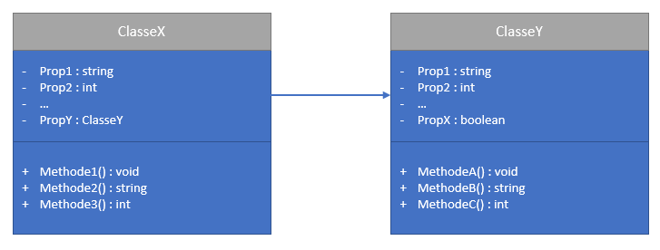

## Modèle Data Transfer Object

*source*: [Java DTO Pattern](https://www.baeldung.com/java-dto-pattern)

One of the best-known principles of programming is ** Single Responsibility **. This principle states that a class must have only one responsibility, therefore only one reason to exist in the code. Well followed, this principle organizes the code in a very readable way and all the classes have a set of methods and properties well scoped to accomplish its roles, correct? Not at all ! Responsibility does not exactly indicate an action. Depending on the * design pattern * used, some classes may be responsible for holding a set of data in their properties, but not for processing them. They are called * Data Transfer Objects * (DTO)

The idea of OOP makes us think of classes as an abstract model that represents a physical object. Properties are characteristics and methods are possible actions to do with this object. If an object contains another, one of its properties can be a reference to it. A classic example would be a class 'Car' with properties like 'color' and 'weight' and methods like 'drive' and 'speed up'. This class could refer to the 'Engine' class for use in its methods.

Structure classique de classes et ses relations

The classic example is easy to understand, but is not useful for all modeling. An example is the process of purchasing with a credit card. The card contains information but does not perform an action, and this information is used by all other classes in the process. We can think of map information as an information packet, or DTO class, which is passed to methods of other classes. Logic is therefore organized like a flow. The methods are called in sequence and they receive the DTO as needed.

Flow de transmission d'un DTO

The process of 'information flow' can make the logic of some applications very intuitive. In a web application, pages or APIs can start processing information with a DTO. An API request or a 'submit' from a button on a page represents a flow of information transformation. The processing sequence starts from the method of a high-level class and makes a sequence of calls to other methods of lower-level classes. At the end of processing, the methods return more information to the flow start point, which ends processing. In design patterns, this is simmilar to the *Chain-Of-Responsibility*, where a class delegates the handling to another class, usually transfering information through paramenters.

DTO's handling flow

One of the biggest advantages of using DTO is the weak coupling between the classes of logic. As the point in common is the DTO, other classes can use interfaces to treat logic in a more abstract way, mainly having the DTO as a parameter to be transferred.
